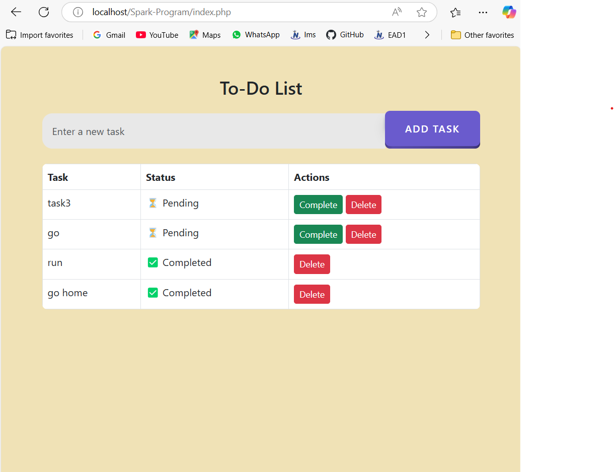
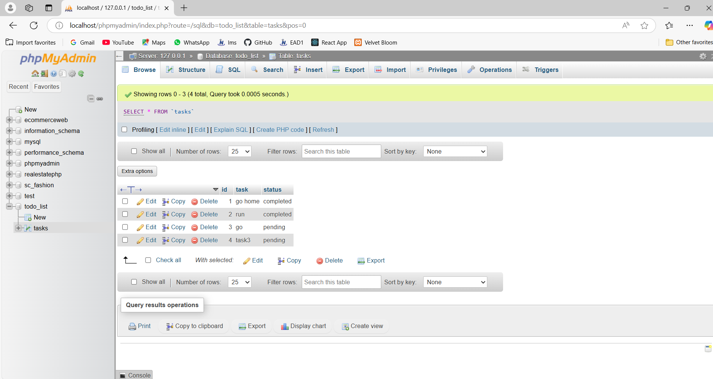

# To-Do List Application

## Setup Instructions

1. Clone the repository:

2. Import the `todo_list.sql` database (found in this repository).

3. Configure `db.php` with your database credentials.

4. Start a local server:

5. Open in your browser:
## Features
✅ Add a new task  
✅ Mark task as completed  
✅ Delete task  
✅ Uses MySQL database  